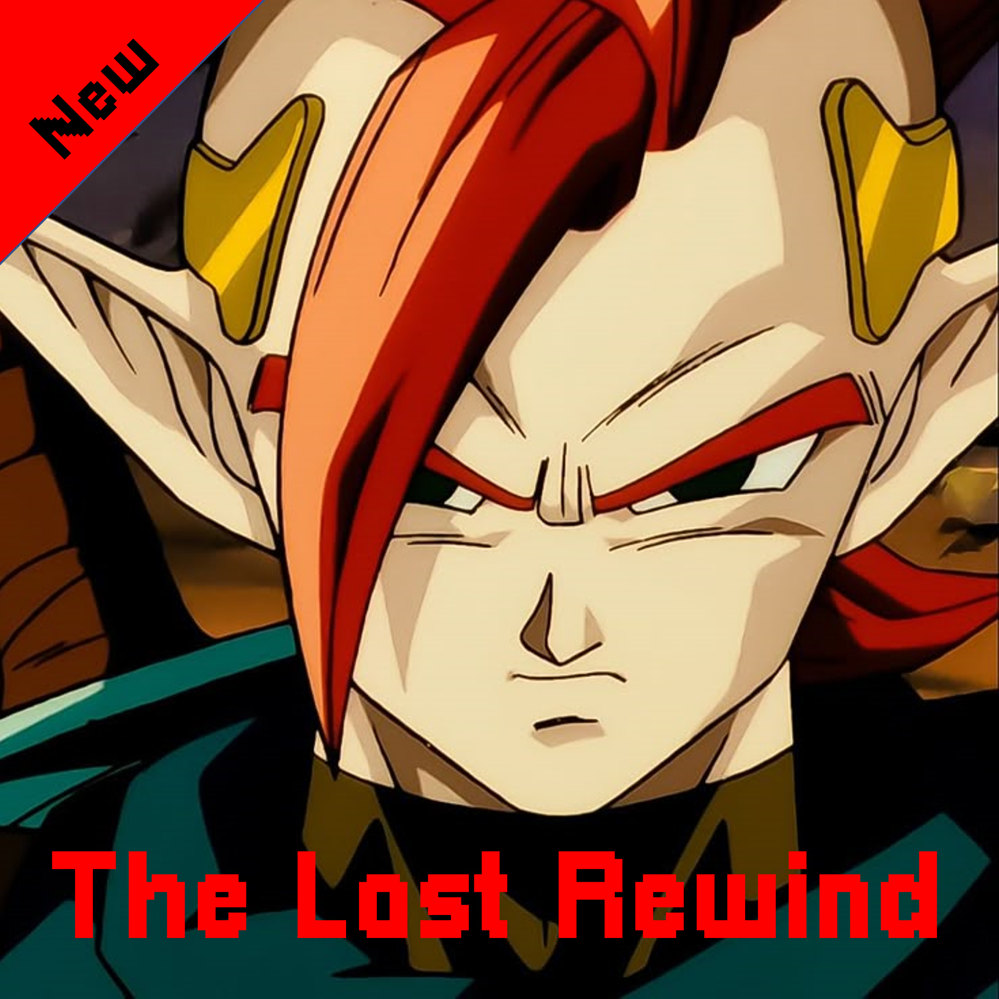
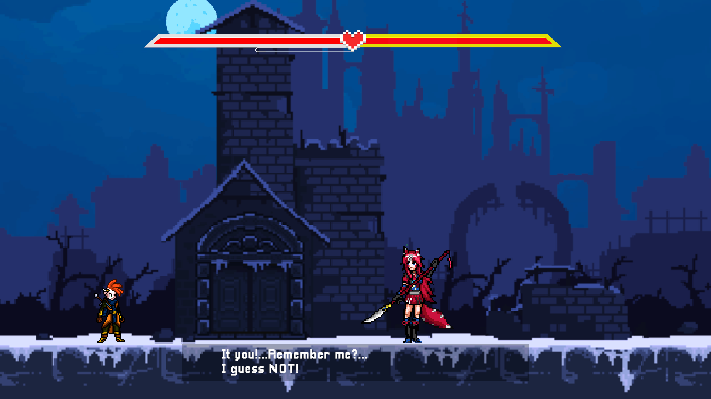
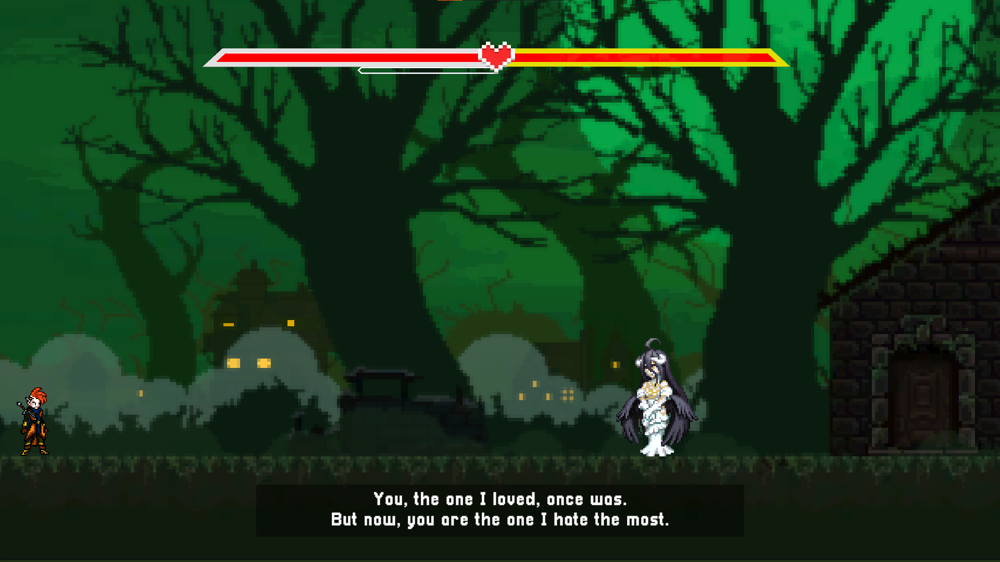
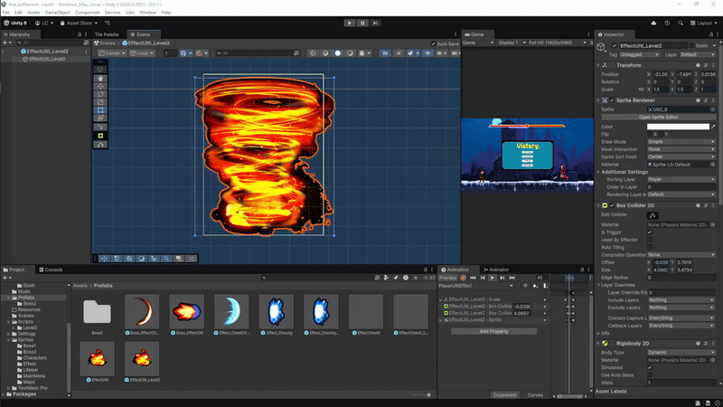
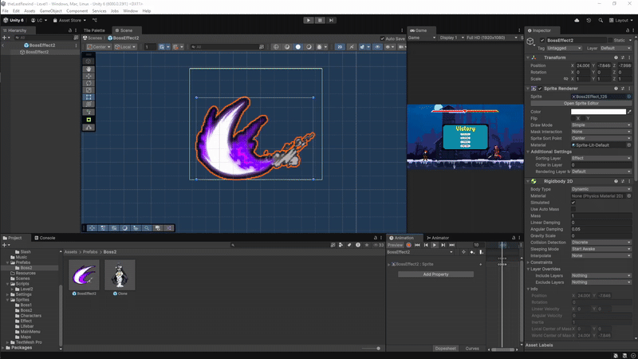
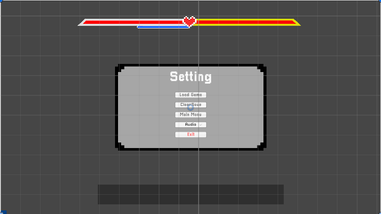

# The Last Rewind

<div align="center">
  
  
  <p><em>A 2D action-adventure Unity game featuring combat system, boss battles, and multiple levels.</em></p>
  
  
</div>

## 🎮 Game Overview

The Last Rewind is an action-packed 2D game where players control a character with combat abilities, special skills, and various movement mechanics. The game features multiple levels with different bosses and challenging gameplay.

<div align="center">
  
</div>
<div align="center">
  
</div>

## ✨ Features

### ⚔️ Combat System
Advanced hit/hurt box collision detection with visual effects


### 👹 Boss Battles
Epic boss fights with unique AI controllers


### 🎯 Skill System
Various player abilities including ultimate skills




### 🎮 Core Features
- **Multiple Levels**: Progress through different challenging levels with unique mechanics
- **Advanced Combat**: Precise hitbox/hurtbox collision detection system
- **Boss AI**: Intelligent boss behavior patterns and attack systems
- **Health System**: Player and enemy health management with visual feedback
- **Skill Effects**: Special abilities with particle effects and animations
- **Level Progression**: Different player controllers for different levels
- **Audio Integration**: Background music and sound effects

## 🛠️ Technical Features

- Built with **Unity Engine** using **C#**
- 2D sprite-based graphics and animations
- Collision detection system for combat
- State machine for player and enemy behaviors
- Scene management and game progression
- UI/UX elements including health bars and menus

<div align="center">
  
  <p><em>Game UI and Health Bar System</em></p>
</div>

## 📁 Project Structure

```
Assets/
├── Scripts/
│   ├── PlayerController.cs          # Main player movement and abilities
│   ├── PlayerControllerLevel2.cs    # Level 2 specific player controller
│   ├── PlayerHitBoxHandle.cs        # Player attack collision detection
│   ├── PlayerHurtBoxHandle.cs       # Player damage collision detection
│   ├── boss1AiController.cs         # Boss AI and behavior
│   ├── BossHitboxHandle.cs          # Boss attack collision
│   ├── BossHurtboxHandle.cs         # Boss damage collision
│   ├── GameManager.cs               # Core game management
│   ├── HealthBarController.cs       # UI health display
│   ├── MainMenu.cs                  # Main menu functionality
│   ├── SkillEffect.cs               # Skill visual effects
│   ├── UltiEffect.cs                # Ultimate ability effects
│   └── Level2/                      # Level 2 specific scripts
├── Scenes/                          # Game scenes
├── Sprites/                         # 2D artwork and textures
├── Animation/                       # Animation controllers and clips
├── Prefabs/                         # Reusable game objects
├── Music/                           # Audio files
└── Resources/                       # Runtime loaded assets
```

## 🎯 Key Components

### Player System
- **Movement**: Smooth character movement with physics
- **Combat**: Attack system with hitbox/hurtbox detection
- **Skills**: Special abilities and ultimate moves
- **Health**: Damage system and health management

### Enemy/Boss System
- **AI Controller**: Intelligent boss behavior patterns
- **Multiple Phases**: Different attack patterns and behaviors
- **Collision System**: Accurate hit detection

### Game Management
- **Scene Transitions**: Level progression system
- **UI Management**: Health bars, menus, and game interface
- **Audio Management**: Background music and sound effects

## 🚀 Getting Started

### Prerequisites
- Unity 2021.3 LTS or later
- Visual Studio or Visual Studio Code
- Git for version control

### Installation
1. Clone the repository:
   ```bash
   git clone https://github.com/luuconghoangnam/thelastrewind.git
   ```

2. Open the project in Unity:
   - Launch Unity Hub
   - Click "Add" and select the project folder
   - Open the project with Unity 2021.3 LTS or compatible version

3. Build and run:
   - Open the main scene from `Assets/Scenes/`
   - Press Play in Unity Editor or build for your target platform

## 🎮 Controls

- **Movement**: Arrow keys or WASD
- **Attack**: Space or designated attack button
- **Special Abilities**: Number keys (1, 2, 3, etc.)
- **Ultimate**: Special key combination
- **Pause**: ESC or designated pause button

## 🔧 Development

### Adding New Features
1. Create scripts in the appropriate `Assets/Scripts/` subdirectory
2. Follow the existing naming conventions
3. Ensure proper collision layer setup for hitbox/hurtbox systems
4. Test thoroughly in Unity Editor before committing

### Contributing
1. Fork the repository
2. Create a feature branch (`git checkout -b feature/new-feature`)
3. Commit your changes (`git commit -am 'Add new feature'`)
4. Push to the branch (`git push origin feature/new-feature`)
5. Create a Pull Request

## 📋 System Requirements

### Minimum Requirements
- **OS**: Windows 10, macOS 10.14, or Linux Ubuntu 18.04
- **Processor**: Intel Core i3 or AMD equivalent
- **Memory**: 4 GB RAM
- **Graphics**: DirectX 11 compatible
- **Storage**: 2 GB available space

### Recommended Requirements
- **OS**: Windows 11, macOS 12, or Linux Ubuntu 20.04
- **Processor**: Intel Core i5 or AMD equivalent
- **Memory**: 8 GB RAM
- **Graphics**: Dedicated graphics card with DirectX 11 support
- **Storage**: 4 GB available space

## 🐛 Known Issues

- Some collision detection edge cases in specific scenarios
- Performance optimization needed for complex scenes
- Audio synchronization in certain situations

## 📝 License

This project is licensed under the MIT License - see the [LICENSE](LICENSE) file for details.

## 👥 Credits

- **Developer**: [Luu Lam Cong]
- **Unity Version**: 2021.3 LTS
- **Additional Assets**: [List any third-party assets used]

## 📞 Contact

- **Email**: luuconghn.lamcong.contacts@gmail.com
- **GitHub**: [@luuconghoangnam](https://github.com/luuconghoangnam)
- **Project Link**: [https://github.com/luuconghoangnam/thelastrewind.git]

---

⭐ **Star this repository if you found it helpful!**