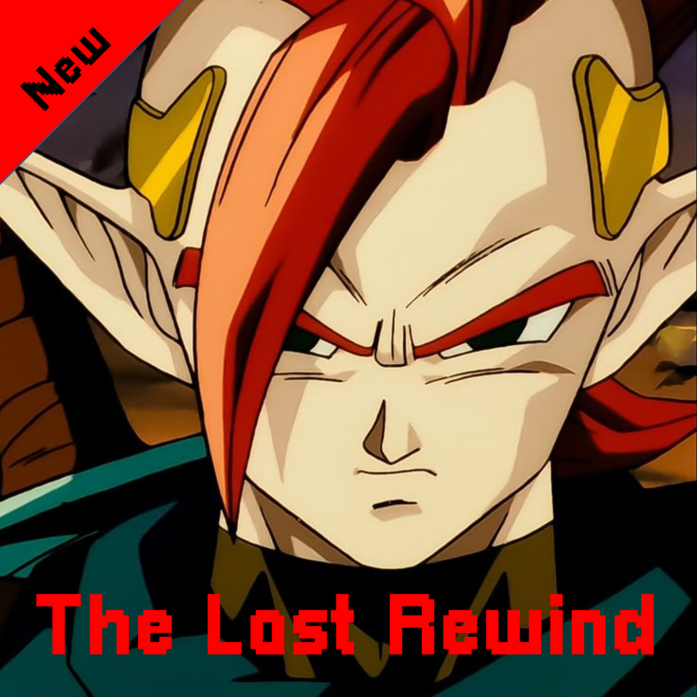
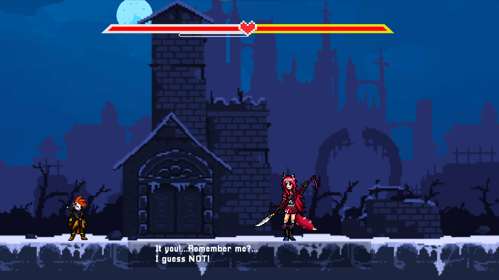
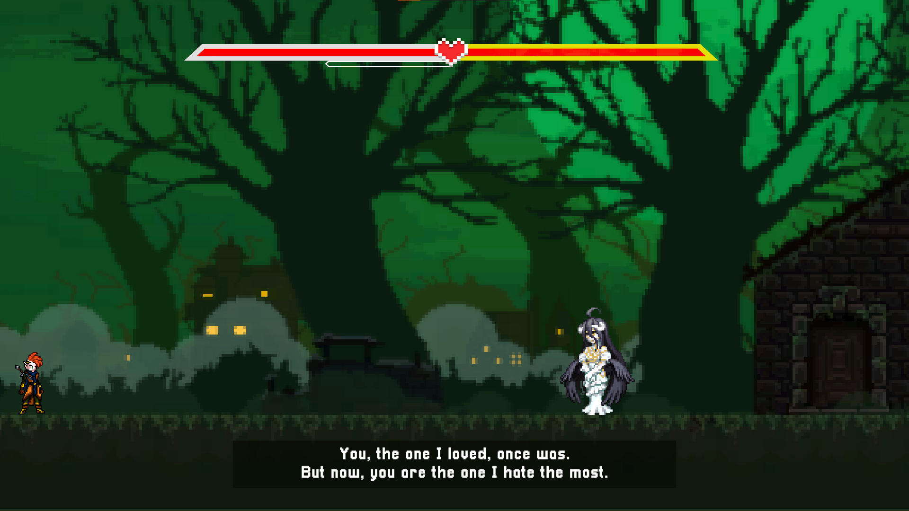
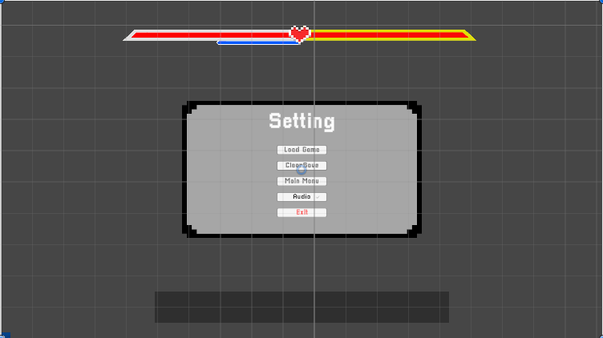
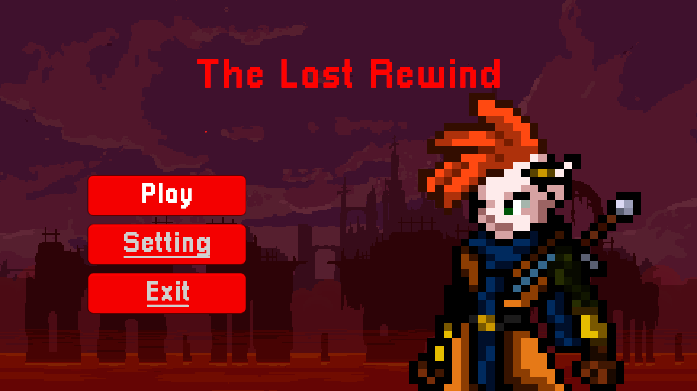

# The Last Rewind

<div align="center">
  
  <p><em>A 2D action-adventure Unity game featuring a deep combat system, boss battles, skills, and multi-level progression.</em></p>
  
</div>

---

## 🎮 Game Overview

**The Last Rewind** là game hành động 2D, nơi bạn điều khiển nhân vật vượt qua nhiều màn chơi với hệ thống chiến đấu đa dạng, kỹ năng đặc biệt, đối đầu boss, và nhiều thử thách khác nhau.

<!-- <div align="center">
  
</div> -->

---

## ✨ Main Features

### ⚔️ Combat System
- Đánh cận chiến với hệ thống hitbox/hurtbox chính xác.
- Đòn đánh thường, combo, và hiệu ứng va chạm.
- Hệ thống sát thương, máu cho cả người chơi và kẻ địch.
- Hiệu ứng kỹ năng, ultimate, particle effect.

<div align="center">
  
  
</div>

### 👹 Boss Battles
- Boss với AI riêng, nhiều giai đoạn tấn công.
- Đòn đánh đặc biệt, thay đổi hành vi theo lượng máu.
- Hiệu ứng tấn công và nhận sát thương.

<div align="center">
  
</div>

### 🎯 Skill & Ultimate System
- Kỹ năng chủ động, ultimate với hiệu ứng riêng.
- Hệ thống cooldown, kích hoạt bằng phím số.
- Hiệu ứng đặc biệt khi sử dụng kỹ năng.

<div align="center">
  
</div>

### 🗺️ Multi-level Progression
- Nhiều màn chơi, mỗi màn có thiết kế, thử thách, boss riêng.
- Controller riêng cho từng màn (ví dụ: PlayerControllerLevel2).
- Hệ thống chuyển màn, lưu tiến trình.

<div align="center">
  
  
</div>

### 🖼️ UI & UX
- Thanh máu, giao diện kỹ năng, hiệu ứng khi nhận sát thương.
- Menu chính, chọn màn, giao diện pause/game over.

<div align="center">
  
  
</div>

### 🔊 Audio & Visuals
- Nhạc nền, hiệu ứng âm thanh cho tấn công, kỹ năng, boss.
- Parallax background, animation nhân vật, boss, hiệu ứng đặc biệt.

---

## 🛠️ Technical Details

- **Unity Engine** (2021.3 LTS)
- **C# scripting**
- Hệ thống quản lý scene, prefab, resource
- State machine cho player và boss
- Hệ thống phát hiện va chạm (hitbox/hurtbox)
- Modular script cho từng chức năng (Player, Boss, UI, Skill...)

---

## 📁 Project Structure

```
Assets/
├── Scripts/
│   ├── PlayerController.cs
│   ├── PlayerControllerLevel2.cs
│   ├── PlayerHitBoxHandle.cs
│   ├── PlayerHurtBoxHandle.cs
│   ├── boss1AiController.cs
│   ├── BossHitboxHandle.cs
│   ├── BossHurtboxHandle.cs
│   ├── GameManager.cs
│   ├── HealthBarController.cs
│   ├── MainMenu.cs
│   ├── SkillEffect.cs
│   ├── UltiEffect.cs
│   └── Level2/
├── Scenes/
├── Sprites/
├── Animation/
├── Prefabs/
├── Music/
├── Resources/
└── ImagesReadme/
```

---

## 🎯 Gameplay Mechanics

- **Di chuyển**: WASD hoặc phím mũi tên
- **Tấn công**: Space hoặc phím tấn công
- **Kỹ năng**: Phím số (1, 2, 3...)
- **Ultimate**: Phím đặc biệt (tùy chỉnh)
- **Pause/Menu**: ESC

---

## 🚀 Getting Started

### Prerequisites
- Unity 2021.3 LTS hoặc mới hơn
- Visual Studio/VS Code
- Git

### Installation
```bash
git clone https://github.com/luuconghoangnam/thelastrewind.git
```
- Mở bằng Unity Hub, chọn đúng version.
- Chạy scene chính trong `Assets/Scenes/`.

---

## 📝 System Requirements

### Minimum
- OS: Windows 10, macOS 10.14, hoặc Linux Ubuntu 18.04
- CPU: Intel Core i3 hoặc tương đương
- RAM: 4 GB
- GPU: DirectX 11 compatible
- Storage: 2 GB

### Recommended
- OS: Windows 11, macOS 12, hoặc Linux Ubuntu 20.04
- CPU: Intel Core i5 hoặc tương đương
- RAM: 8 GB
- GPU: Dedicated graphics card
- Storage: 4 GB

---

## 🐛 Known Issues

- Một số trường hợp va chạm chưa chính xác
- Cần tối ưu hiệu năng cho màn chơi phức tạp
- Âm thanh đôi khi chưa đồng bộ

---

## 👥 Credits

- **Developer**: [Luu Lam Cong]
- **Unity Version**: 2021.3 LTS
- **Additional Assets**: [Liệt kê asset bên ngoài nếu có]

---

## 📞 Contact

- **Email**: luuconghn.lamcong.contacts@gmail.com
- **GitHub**: [@luuconghoangnam](https://github.com/luuconghoangnam)
- **Project Link**: [https://github.com/luuconghoangnam/thelastrewind.git]

---

⭐ **Star this repository if you found it helpful!**